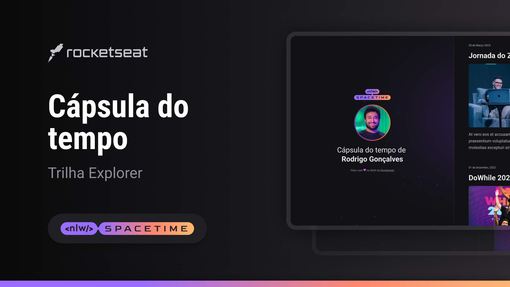

 

## 🖥️ projeto
Esse e um projeto web responsivo de uma capsula do tempo para exibir memorias em uma linha do tempo

## 🚀 tecnologias 
esse projeto foi desenvolvido durante o NLW da Rocktseat com as seguintes tecnologias:
-HTML
-CSS
-Git e Github

## 🏷️ layout 
voce pode visualizar o layout do projeto atraves
[desse link] (https://www.figma.com/file/7k52mRAlTTnQeHP2bXt86i/C%C3%A1psula-do-tempo-%E2%80%A2-Trilha-Explorer-(Community)-(Copy)?type=design&node-id=306%3A84&mode=design&t=lV63HzPBHyqiR61M-1).
e necessario ter uma conta no [figma](https://www.figma.com)
